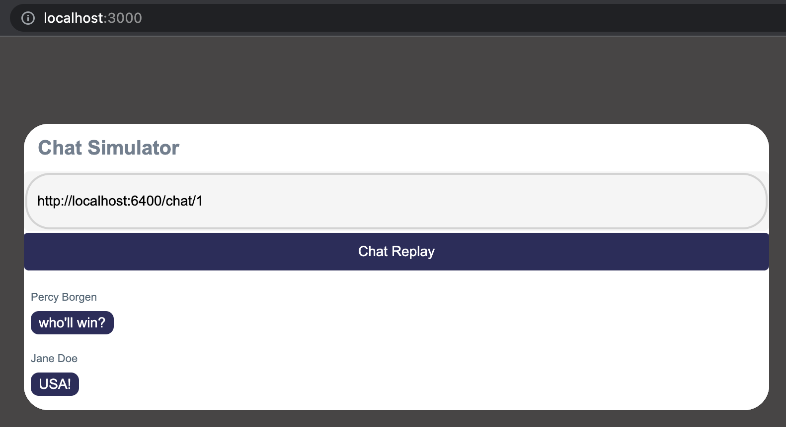

# Chat Simulator #

### What is this? ###

* This project is a client-side "chat simulator" that takes the URL of a JSON chat transcript and displays a replay of the chat.

### How do I get set up? ###

#### Requirements

* Recommended [node](https://nodejs.org/en/) v17.8.0 or higher

#### Install Dependencies

* In the project directory, run:  
`npm i`

#### Start application  
* Start the express server and run the app in development mode  
`npm start`  

* Open [http://localhost:3000](http://localhost:3000) to view the application in your browser.  
* In the top input bar, type a valid chat URL such as [http://localhost:6400/chat/1](http://localhost:6400/chat/1) or [http://localhost:6400/chat/2](http://localhost:6400/chat/2) and hit enter to see the chat replay.  
  

#### Run tests  
* Run the component and Cypress end-to-end BDD tests. Feature files can be found [here](./cypress/e2e/features/).  
`npm test`  

### Contact ###

* Author - [Tonnia Rienne](mailto:tonnia.rienne@gmail.com)  
